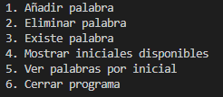

# Guía para futuros Políglotas

## Saludos usuario

Si has llegado hasta aquí es porque necesitas ayuda para emprender tu viaje en pos del conocimiento

Al entrar has debido de ver el siguiente menú, muy bien dejame explicarte la función de cada opción:

**Opcion 1:** Esta función te pedirá una palabra que quieras añadir, pero ojo porque esta se almacenara sin espacios ni mayusculas asi que puedes escribir 'PE rRo' que lo guardara como perro. 

**Recuerda** A más palabras acabes añadiendo más rico será tu vocabulario el cual te alzará hasta el trono.

**Opción 2:** Está función al igual que la anterior pedirá una palabra, en este caso se mirará si se encuentra almacenada y en caso que a si sea se eliminará.

**Opción 3:** Esta opción al igual que las anteriores te solicitara una palabra, lesta función tiene como objetivo ver si una palabra se encuentra ya registrada.

**Opción 4:** Con esta opción se podrán ver las iniciales de las palabras que se han almacenado, puedes pensar en esto como en un índice.

**Opción 5:** Esta opción mostrará las palabras guardadas que empiecen por la letra que le pases.

**Opción 6:** Esta opción cerrará el diccionario.

**AVISO**

**Recuerda acabar tus lecciones o acabarás como twitter.**

Si desea volver al readme pulse [aquí](../README.md)